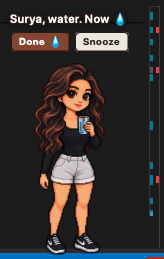
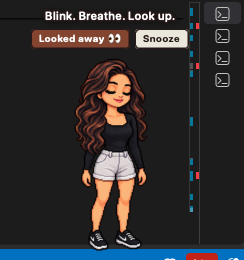
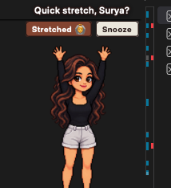
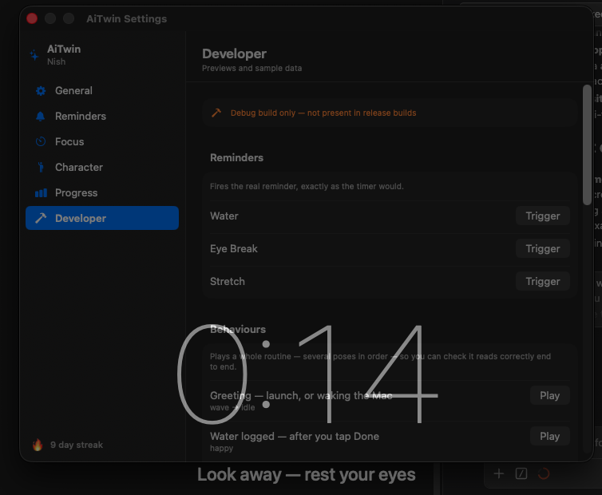
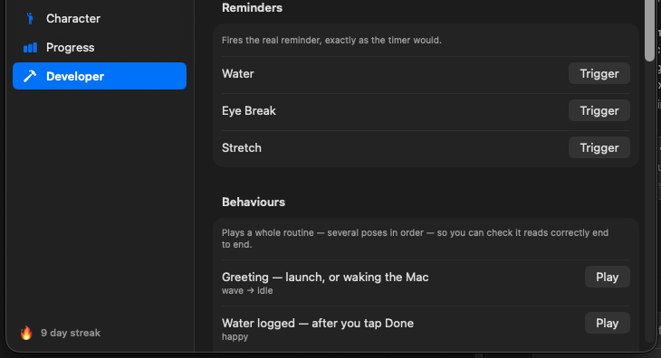
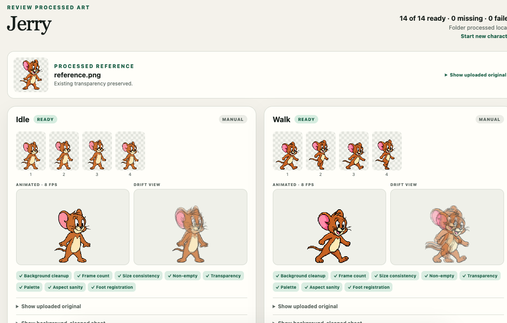
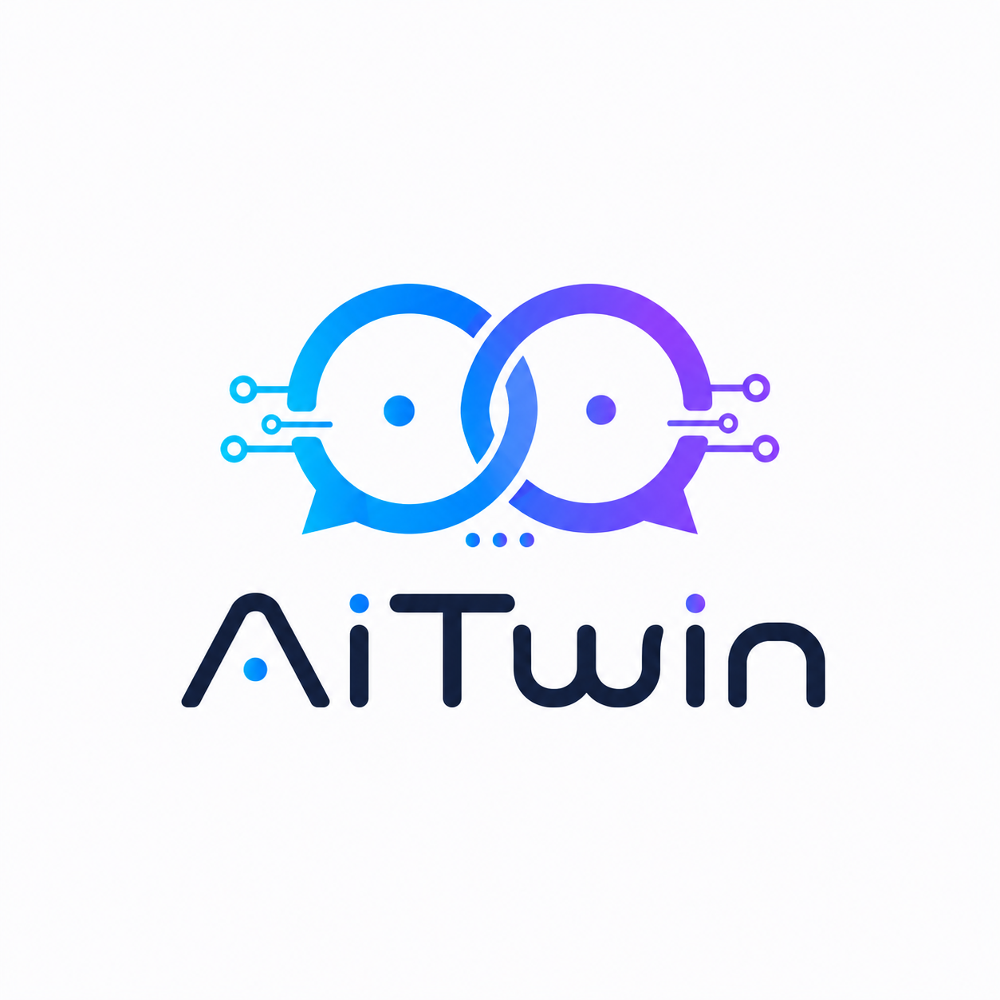

# AiTwin

**A pixel-art desktop companion for macOS that reminds you to drink water, rest
your eyes and get out of your chair.**

A small character lives at the corner of your screen. She greets you when you
sit down, walks over every so often to remind you to drink something, dims the
whole screen when you have been staring at it too long, and sits down to read
beside you while you focus. Then she leaves you alone.

No Dock icon. No windows. No notification spam.

<p align="center">
  
  
  
</p>

---

## Download

**[⬇ Download the latest release](https://github.com/ksuresh21/Ai-Digital-Twin/releases/latest)**

Grab `AiTwin-1.0.0.dmg` from the **Assets** list on that page.

### Installing

1. Open the `.dmg` and drag **AiTwin** into your **Applications** folder.
2. **Right-click AiTwin → Open.** Do not double-click it the first time.
3. macOS will warn that the developer cannot be verified. Click **Open**.

That second step matters. AiTwin is signed ad-hoc rather than with a paid Apple
Developer certificate, so a plain double-click gives you *"AiTwin cannot be
opened because the developer cannot be verified"* with no way through. The
right-click route offers an **Open** button that a double-click does not. You
only need to do it once.

If macOS still refuses, clear the download flag by hand:

```bash
xattr -d com.apple.quarantine /Applications/AiTwin.app
```

Once it launches, look for the AiTwin mark in your menu bar — there is no Dock
icon and no window. Click it for the menu, and open **Settings** to set your
name and your reminder intervals.

**Requires macOS 14 (Sonoma) or later.**

---

## What it does

### Reminders

- **Water.** She walks over with a glass. Tracked in millilitres against a daily
  goal you set — 3 litres by default, in 250 ml glasses.
- **Eye breaks.** Every 40 minutes by default — 20, 30, 40, 45 or 60 is a
  picker away — she asks you to look away. Accept, and the
  **entire screen dims** with a large countdown in the middle of it, because a
  reminder you can dismiss in half a second does not make anyone rest their
  eyes. It is visual only — it never blocks a click or a keystroke.
- **Posture.** She stands up and stretches every hour, so you remember to.

Each one can be accepted or snoozed, and each has its own interval and its own
on/off switch.

**Sounds** live in General: one switch to silence the lot, and a choice of any
of macOS's built-in alert tones for three moments — a reminder arriving, an eye
break ending, and a focus phase ending. Picking a tone plays it, so you are not
choosing between fourteen names you have never heard. The eye-break one earns
its keep: your screen is dimmed and you are deliberately looking away, so a
sound is the only way to be told the break is over.

<p align="center">
  
</p>

### Focus sessions

A Pomodoro timer from the menu bar. She sits down and reads beside you with a
countdown above her head, and every reminder is held until the break — so
nothing interrupts you mid-thought. The reading animation is deliberately
near-motionless: movement in peripheral vision breaks concentration.

### Moods, and knowing when to stay quiet

She is not a timer with a face. She notices things:

- Waved three reminders away in a row, or worked three hours without a break?
  She comes over to check on you, and waits for you to say you are okay.
- Late at night, or five hours in? She yawns twice and leaves you to it.
- Idle chatter, rarely, leaning in from the very edge of the screen rather than
  walking all the way over.

And she stays quiet when she should: during quiet hours, while you are away from
the keyboard, and while a focus session is running.

### Away from your Mac

Lock your screen and everything stops. No countdown advances, no work time
accumulates, and she cannot appear on the lock screen. Come back after a real
absence and **every timer restarts from zero** — a reminder measures how long you
have been *at* your Mac, so it should not ambush you the moment you sit down.
Under a minute away changes nothing, because locking your screen on the way to
the kettle should not cost you fifteen minutes of progress.

### Progress

Today at a glance — litres drunk against your goal, breaks taken, stretches
done, focus sessions, and how many you skipped — plus an hour-by-hour line of
your day, and seven-day charts for each activity.

Everything is stored **on your Mac only** and never leaves it. Export it as CSV
whenever you like. Daily totals are kept for good; once a month AiTwin offers to
clear out the hour-by-hour detail behind them, and it never deletes anything
without you confirming.

<p align="center">
  
</p>

---

## Bring your own character

The bundled character is a placeholder. The point is to use your own.

**Settings → Character → drag a `.zip` onto the drop zone.** AiTwin resizes and
aligns every frame for you, so art drawn at any size works — you do not need to
match a canvas, a scale or a baseline.

A character pack is a folder of animation folders:

```
MyCharacter/
├── Idle/          idle_01.png  idle_02.png  …
├── Walking/       walk_01.png  …
├── Waving/        wave_01.png  …
├── WaterReminder/ drink_01.png …
├── EyeBreak/      eyebreak_01.png …
└── …
```

Only `Idle/` is required. Everything else falls back to it, so you can start
with one folder and add more later. The full list of folders, frame counts and
prompts for generating them is in **[Docs/PROMPTS.md](AiTwin/Docs/PROMPTS.md)**.

### Generating one from a photo

There is a companion tool for this — a small browser app that turns one
reference image into a finished, installable pack. Point it at a photo of a
person, a pet, or a cartoon character; it builds the prompts, you paste them
into ChatGPT or Gemini, and it slices, cleans, normalises and zips the results.

<p align="center">
  
</p>

It checks its own work: frame counts, size consistency, transparency, palette
drift against the reference, and whether the feet stay planted between frames.
The animated preview and the overlaid "drift view" let you catch a bad frame
before it ever reaches your desktop.

It lives on the [`dev` branch](https://github.com/ksuresh21/Ai-Digital-Twin/tree/dev/CharacterGenerator).

> The character in that screenshot is shown only to demonstrate the tool.
> Jerry is © Warner Bros. Entertainment Inc. and is not part of this project.

---

## Building from source

No Xcode needed — the Command Line Tools are enough.

```bash
git clone https://github.com/ksuresh21/Ai-Digital-Twin.git
cd Ai-Digital-Twin/AiTwin
swift test                    # ~380 tests, about two seconds
./Scripts/build-app.sh        # production build
open build/AiTwin.app
```

`./Scripts/build-app.sh --dev` gives you a build with a **Developer** tab in
Settings for firing any reminder, playing any animation and loading sample
history. That tooling is compiled out of release builds entirely — it is not
merely hidden, it is absent from the binary.

`./Scripts/package-dmg.sh` produces the installable `.dmg`.

### How it is put together

Five modules, each depending only on the one below it:

| Module | What is in it |
|---|---|
| `AiTwinCore` | The whole domain. Foundation only — no AppKit, no SwiftUI. |
| `AiTwinPlatform` | Protocols for the handful of things the domain needs an OS to do. |
| `AiTwinMac` | The macOS implementations. AppKit lives here and nowhere else. |
| `AiTwinUI` | SwiftUI views. |
| `AiTwinApp` | Composition root. The only place that knows about both halves. |

Timing is driven by an injected clock and an explicit `tick()` rather than
internal timers, which is why a full day of reminders can be simulated in
microseconds and the entire suite runs in about two seconds.

More in **[Docs/ARCHITECTURE.md](AiTwin/Docs/ARCHITECTURE.md)** and
**[Docs/DEVELOPMENT.md](AiTwin/Docs/DEVELOPMENT.md)**.

---

## Licence

**[CC BY-NC-SA 4.0](LICENSE)** — Attribution, NonCommercial, ShareAlike.

Use it, read it, change it, share it. Two conditions: **credit
[Suresh K](https://github.com/ksuresh21)** and link back here, and **do not use
it commercially**. Improvements must stay under the same licence so they remain
open to everyone. Want to use it commercially? Ask.

The bundled **Nish** character is a personal likeness. It ships so the app
works out of the box, but all rights in it are reserved and it is **not**
covered by the licence — please generate your own rather than reusing it.

---

<p align="center">
  
</p>
